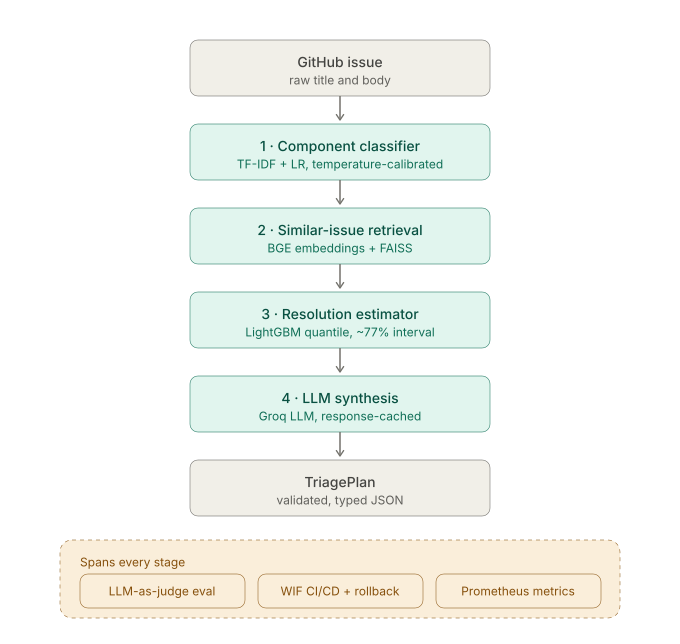

# TriageIQ

TriageIQ turns raw GitHub issues into structured triage decisions in under 4 seconds. Given an issue title and body, it runs a four-stage ML pipeline — component classification, similar issue retrieval, resolution-time prediction, and LLM synthesis — and returns a JSON `TriagePlan` with predicted component, similar issues, expected resolution window, priority assessment, and suggested next steps. It is trained on ~20K real issues from `microsoft/vscode` and `kubernetes/kubernetes`, deployed to Cloud Run, and built to demonstrate a full production ML lifecycle: evaluation, reproducible builds, Prometheus metrics, fail-closed auth, Workload Identity Federation CI/CD, and CVE-audited dependencies.



---

## Live API

**Base URL:** `https://triageiq-api-779563952988.us-central1.run.app`

```bash
# Service info
curl https://triageiq-api-779563952988.us-central1.run.app/

# Triage an issue
curl -s -X POST https://triageiq-api-779563952988.us-central1.run.app/triage \
  -H "Content-Type: application/json" \
  -d '{
    "repo": "microsoft/vscode",
    "title": "Editor crashes when opening large JSON files",
    "body": "VS Code becomes unresponsive on files > 50MB. Reproducible on 1.85.0, Windows 11. No workaround found."
  }' | python -m json.tool
```

**Supported repos:** `microsoft/vscode`, `kubernetes/kubernetes`  
**Rate limits:** 10 requests/hour, 30/day per IP. `/`, `/health`, and `/metrics` are not rate-limited.  
**Latency:** ~23s cold start (model loading on first request), ~3.5s warm p50 end-to-end.

---

## Architecture

```
POST /triage {repo, title, body}
        │
        ▼
┌───────────────────────────────────────┐
│ System 1: TF-IDF Component Classifier  │  ~5ms p50
│ Logistic Regression, 28–35 classes    │
│ vscode: 90.4% top-3 acc (69.0% top-1) │
└──────────────────┬────────────────────┘
                   │ top-3 component candidates + confidence
                   ▼
┌───────────────────────────────────────┐
│ System 2: Similar Issue Retriever      │  ~27ms p50
│ BGE-base-en-v1.5 + FAISS cosine       │
│ k8s related R@5 9.3% (clean, weak)    │
│ vscode dup R@5 43.5% (clean)          │
└──────────────────┬────────────────────┘
                   │ top-5 similar issues + similarity scores
                   ▼
┌───────────────────────────────────────┐
│ System 3: Resolution Time Predictor    │  ~4ms p50
│ LightGBM quantile regression, 79 feats│
│ k8s +1.4% vs naive; vscode 0.0%      │
└──────────────────┬────────────────────┘
                   │ p10/p50/p90 days estimate
                   ▼
┌───────────────────────────────────────┐
│ System 4: LLM Triage Assistant         │  ~3s p50
│ Groq llama-3.1-8b-instant, 3-shot    │
│ JSON TriagePlan with retry + fallback  │
└──────────────────┬────────────────────┘
                   │
                   ▼
TriagePlan JSON: predicted_component, similar_issues,
expected_resolution_days, priority_guess,
suggested_next_steps, triage_summary
```

---

## Evaluation

| System | Repo | Metric | Value |
|---|---|---|---|
| Component classifier | vscode | **Top-3 accuracy (primary — see note)** | **90.4%** [85.3, 93.8] |
| Component classifier | vscode | Top-1 accuracy (secondary) | 69.0% [62.0, 75.2] |
| Component classifier | kubernetes | **Top-3 accuracy (primary — see note)** | **82.5%** [77.7, 86.5] |
| Component classifier | kubernetes | Top-1 accuracy (secondary) | 51.4% [45.6, 57.1] |
| Component classifier | vscode | Macro F1 (top-1) | 0.585 |
| Component classifier | kubernetes | Macro F1 (top-1) | 0.466 |
| Component classifier | vscode | Inference latency p50 | 4.9ms |
| Similar issue retriever | kubernetes | **Recall@5, related task (corrected, prod-matching — see note)** | **18.0%** [12.0, 24.0] |
| Similar issue retriever | kubernetes | Recall@1 / @10 (related task, corrected) | 9.3% / 23.3% |
| Similar issue retriever | vscode | **Recall@5, duplicate task (corrected, prod-matching — see note)** | **50.5%** [43.0, 57.5] |
| Similar issue retriever | vscode | Recall@1 / @10 (duplicate task, corrected) | 27.0% / 59.5% |
| Similar issue retriever | vscode | Recall@5, related task (directional, n=19 — see note) | 63.2% [42.1, 84.2] |
| Similar issue retriever | vscode | Index size (BGE) | 24.3 MB |
| Resolution predictor | kubernetes | Point estimate: MAE vs naive (served) | 104.05d vs 106.29d naive (+2.1%) |
| Resolution predictor | kubernetes | Bucket classifier: accuracy vs naive (served) | 33.24% vs 29.97% naive (+3.27pp [+1.80, +4.74]) |
| Resolution predictor | kubernetes | CQR conformal coverage (target 80%) | 76.2% [73.5, 78.6] |
| Resolution predictor | kubernetes | Inference latency p50 | 1.5ms |
| Resolution predictor | vscode | Point estimate: MAE vs naive (served — see note) | 6.02d vs 3.53d naive (**−70.5%, worse than naive**) |
| Resolution predictor | vscode | Bucket classifier: served output (see note) | **naive-prior fallback** (~33% conf) — raw classifier loses to naive by −22.08pp [−25.81, −18.02] |
| Resolution predictor | vscode | CQR conformal coverage (target 80%) | 74.6% [69.9, 78.8] |
| Resolution predictor | vscode | Inference latency p50 | 1.4ms |
| LLM synthesis (judge, /15) | kubernetes | Mean-band score (regression detector only) | 10.51/15 (70.1%) |
| LLM synthesis (judge, /15) | vscode | Mean-band score (regression detector only) | 8.36/15 (55.8%) |
| LLM synthesis | kubernetes | **Floor-fail rate (see note)** | **9.4%** [4.0, 19.9] |
| LLM synthesis | vscode | **Floor-fail rate (see note)** | **45.5%** [21.3, 72.0] |
| LLM synthesis | kubernetes | Fabrication rate (grounding-verified, see note) | 1.9% |
| LLM synthesis | vscode | Fabrication rate (grounding-verified, see note) | 9.1% |

95% Wilson CIs shown in brackets where computed on a held-out test split.

> **Headline finding (2026-07-19, final framing per ADR-0033, supersedes the 2026-07-16
> framing below): retrieval quality is now measured on a clean, hand-verified, disjoint
> eval set — and it's honestly weaker than previously reported, not better.** k8s's clean
> product-task R@5 (issue → related issue, its only available task — vscode has a
> duplicate-comment channel k8s never had) is **9.3% [5.3, 14.0]** (n=150,
> hand-verified genuine by construction) — down from the previously-reported 23.5%, which
> was itself measured on a gold set later found to be title_sim-contaminated (ADR-0032).
> Two factors plausibly explain the drop, not fully disentangled: cleaner (harder, less
> lexically-inflated) pairs, and a ~2x larger candidate corpus (30,000 vs. the old index's
> 15,000) that mechanically lowers recall. **vscode reverses its "unmeasured" status**:
> its `dup_comment` channel — never precision-audited before ADR-0033 — turned out to be
> vscode's largest, cleanest channel (85% precision, n=2,242), giving a properly powered
> duplicate-task R@5 of **43.5% [37.0, 50.5]** (n=200). vscode's separate related-issue
> task (non-duplicate) stays underpowered (n=19, directional only, reported but never
> gated) — vscode is genuinely two different tasks, reported separately, never blended.
> Full reasoning: [`docs/architecture/adr/0033-clean-retrieval-data-trustworthy-eval.md`](docs/architecture/adr/0033-clean-retrieval-data-trustworthy-eval.md).
>
> **Harness correction (2026-07-24, ADR-0035, supersedes the 2026-07-23 framing below) —
> three measurement bugs found and fixed; the corrected picture is weaker-but-real baselines
> and NO SIGNAL from fine-tuning, not a confirmed regression.** GG's call after five
> independent retrieval-improvement techniques all failed: "stronger evidence of a broken
> harness than of a uniquely hard task." The audit found (1) every eval query was **title-only**
> while production embeds title+body untruncated (`triage.py`) — eval-set JSON never populated
> `query_body`; (2) the D2 fine-tune trained/saved **mean pooling** against BGE-base's native
> **CLS-token pooling**; (3) training truncated at 128 tokens, cutting **65.73%** of examples
> (measured token-length p95=230, corrected to 256); (4) all three ADR-0031 levers were measured
> against an unaudited, pre-D1 pair population (277/292 pairs, only 72%/20% hand-verified
> genuine) instead of D1's clean, disjoint eval sets. **Corrected canonical baselines: k8s R@5
> 9.3%→18.0% [12.0, 24.0], vscode R@5 43.5%→50.5% [43.0, 57.5]** (both nearly double/gain 7pts
> — production was always this good, only the measurement undersold it). **All four ADR-0031
> levers are still rejected** on the corrected harness, but **weighted fusion flipped sign** —
> originally reported as marginally shipping (+3.25pp k8s, +4.11pp vscode, both CIs excluding
> zero), it's now flat on k8s and a **significant vscode regression** (−8.0pp, CI [−13.5,−3.0]).
> BM25-alone (newly measured) is the *weaker* system on both repos, not a diluted strong
> signal. **The D2 fine-tune conclusion is WITHDRAWN**: re-run with both bugs fixed, the result
> is **+2.0pp R@5 (50.5%→52.5%), CI [−4.5, +8.5]** — every metric moved positive (a full sign
> reversal from the withdrawn "confirmed regression"), but no CI excludes zero. At n=200 the CI
> half-width is ≈±6.5pp — **this is underpowered, not disproven**; whether more data or
> different hyperparameters would show a real, detectable lift is genuinely open. Still
> flagged, not fixed: corpus/query truncation asymmetry (512 vs. untruncated), BGE's unused
> query instruction prefix, BM25 tokenization uninspected. Nothing in production changed —
> confirmed the served index and model are untouched throughout. Full reasoning:
> [`docs/architecture/adr/0035-retrieval-harness-correction.md`](docs/architecture/adr/0035-retrieval-harness-correction.md).
>
> **D2 fine-tune result (2026-07-23, ADR-0034 — historical, WITHDRAWN above, kept for
> provenance): confirmed regression, BGE-base off-the-shelf stays the shipped retriever.**
> D1's clean, disjoint vscode_duplicate data (1,734 training pairs, leakage guard PASSED
> 0-overlap on every run) was fine-tuned locally (BGE-base, MNRL loss, measure-first single
> run: 5 epochs, lr=2e-5). Result: **R@5 38.5% vs. the 43.5% baseline (−5.0pp, CI [−11.0,
> +0.5])** — every metric moved backward. A diagnostic leg then tested the leading alternative
> explanation (overfitting) directly: 2 epochs, lr=1e-5 — the textbook anti-overfit fix, ending
> training at a 5.7× higher, far-less-memorized loss (0.255 vs. 0.045). If overfitting were the
> cause, this should have recovered some of the gap. Instead **R@5 dropped further to 33.5%
> (−10.0pp, CI [−16.0, −4.5], excludes zero)** — reported at the time as a statistically
> confirmed regression. **This reasoning is now known to be wrong** (ADR-0035, above): both
> runs trained with mean pooling against BGE's native CLS pooling and truncated 65.73% of
> training examples at 128 tokens — the diagnostic leg never isolated either confound, so it
> could not have ruled out overfitting as *the* mechanism. Kept here for historical accuracy
> of what was reported and when; superseded finding is above. Original ADR:
> [`docs/architecture/adr/0034-d2-retrieval-finetune-honest-negative.md`](docs/architecture/adr/0034-d2-retrieval-finetune-honest-negative.md).
>
> **Prior framing (2026-07-16, ADR-0030/0031/0032 — historical, superseded above): k8s
> product-task retrieval is genuinely weak, hand-verified; vscode product-task retrieval is
> currently UNMEASURED.** k8s Recall@5 on the actual product task ("given a new issue, find
> related issues"), against the actually-deployed live index: **23.5% [18.4, 28.5]** (n=277) —
> the lowest absolute score of any model in this system's per-model audit (classifier top-3
> 82.5%/90.4%, resolution's real k8s bucket gains, synthesis's floor-fail rates). A
> hand-judged precision audit (ADR-0032) confirms this number is real, not eval noise: 72%
> of the underlying gold pairs are genuinely related, and pulling the incidental 28% out
> doesn't move Recall@5 outside its own confidence interval. Three untried,
> zero-training improvement levers were then tried against it and **all three failed to
> clear the bar** (ADR-0031): hybrid BM25+dense fusion (CI crosses zero), a pretrained
> cross-encoder reranker (quality regresses on both repos, +190-330x latency), and a
> stronger pretrained embedder (CI crosses zero). The earlier "vscode is statistically
> indistinguishable from k8s, both ~23-27%" framing was retired: the same precision audit
> (ADR-0032) found vscode's gold pairs were only 20% genuinely related (94.9% sourced from
> an unaudited title-similarity channel, dominated by blank-template and
> generic-crash-title collisions). Full reasoning:
> [`docs/architecture/adr/0030-phaseC-product-task-feasibility.md`](docs/architecture/adr/0030-phaseC-product-task-feasibility.md),
> [`docs/architecture/adr/0031-retrieval-quality-improvement.md`](docs/architecture/adr/0031-retrieval-quality-improvement.md),
> [`docs/architecture/adr/0032-product-task-gold-pair-quality-audit.md`](docs/architecture/adr/0032-product-task-gold-pair-quality-audit.md).
>
> **Classifier metric correction (2026-07-11).** The product never surfaces a single
> label — `triage.py` builds `classifier_top3` and `grounding.py::verify_plan_grounding`
> defines a correct prediction as top-3 membership, not top-1 equality. Reporting only
> top-1 materially understated the classifier's real-world usefulness (a 21–31pp gap,
> non-overlapping CIs, same model + test split — no retraining involved). Additionally,
> 30.4% of the kubernetes test set and 8.0% of vscode's have more than one valid
> component label that gets collapsed to one at preprocessing time; crediting a
> prediction that hits any valid label (not just the collapsed one) raises accuracy
> further to 59.4% (k8s) / 71.7% (vscode) top-1. Full methodology:
> [`reports/model_eval_audit.json`](reports/model_eval_audit.json) → `component_classifier`.
>
> **Retriever metric correction (2026-07-11).** The advertised vscode Recall@5 (36.7%)
> was measured against `data/gold_related.parquet` (v1), which is only 74.0% genuine
> issue→issue pairs — the rest are PR→issue or duplicate-comment pairs, an easier proxy
> task the product doesn't perform. The next candidate honest number, measured against
> the actually-deployed live index, was 26.7% [21.6, 31.9] — a ~10pp inflation, CIs do not
> overlap. (This superseded ADR-0028's originally-reported 22.4% [17.7, 28.0] — n=254,
> ADR-0031 (2026-07-12) found no committed script ever reproduced that number and its
> denominator didn't match the full product stratum; 26.7%/n=292 is the byte-reproducible
> number via `scripts/phaseC_vscode_live_product_eval.py`.) **This 26.7% number was itself
> retired five days later (ADR-0032, below) — it wasn't a wrong computation, but a
> computation against a gold set later found to be ~80% incidental.**
>
> **k8s retriever re-eval (2026-07-12, ADR-0030).** kubernetes was first reported as
> "unmeasurable" (zero product-task pairs land in the *test-split* of the live corpus).
> That framing was wrong: the live-serving retriever is an off-the-shelf pretrained
> `BAAI/bge-base-en-v1.5` checkpoint, never trained on any gold pair — only a separate,
> unshipped fine-tuned artifact is — so the train/val/test split (built to prevent
> leakage for *that* fine-tune) carries zero leakage risk for the live model. Every
> product-task pair whose query and target both fall in the live index's number range
> is usable for measurement regardless of split label: 277 of 776 pairs, evaluated with
> the same method and bootstrap CI as vscode's number above
> (`scripts/phaseC_k8s_live_product_eval.py`) — see the headline finding above for the
> result. A W3 fine-tune was evaluated against both a proxy gate task and the product task
> (`docs/architecture/adr/0027-w3-retry-stratified-eval.md`): proxy-task gains were real
> and significant (k8s +14.3pp, vscode +4.6pp) — this gate stratum is unaffected by the
> gold-pair-quality finding below (ADR-0032 Finding 4: it's sourced from PR-query/
> dup_comment pairs, not the contaminated `title_sim` channel). Product-task gains were
> directionally positive and underpowered on both repos (k8s +3.5pp, vscode +3.2pp, both
> CIs cross zero) — **held, and stays held on both repos, per
> `docs/architecture/adr/0030-phaseC-product-task-feasibility.md`: NO-GO on mining more
> product-task pairs to gate either fine-tune, decided on value, not feasibility.** k8s's
> data ask was disproportionate anyway (~6,075 pairs, ~8x the current stratum), but
> that's not the operative reason — proving a ~3.5pp lift on top of a 23.5% base rate
> would still ship a retriever that misses the related issue 3 times out of 4. vscode's
> data gap is smaller and closeable (~664 more pairs), but closing it would only prove a
> +3.2pp lift against a ~23-27% base rate — the same weak-baseline problem, just with an
> easier data path. Neither fine-tune is a near-miss awaiting data; both are marginal
> against a weak baseline.
>
> **Retrieval-quality-lever pass (2026-07-12, ADR-0031).** Hybrid BM25+dense fusion, a
> pretrained cross-encoder reranker (the ADR-0006 retry against the corrected metric), and
> a stronger pretrained embedder were each tried against the product-task R@5 bar. All
> three rejected — see the headline finding above and
> [`docs/architecture/adr/0031-retrieval-quality-improvement.md`](docs/architecture/adr/0031-retrieval-quality-improvement.md)
> for full per-lever results. The two remaining paths (in-domain fine-tuning, which
> reopens the leakage question ADR-0030 deliberately kept closed; or new related-pair
> mining, already NO-GO'd on value grounds) are both harder and were explicitly deferred,
> not attempted here.
>
> **Gold pair quality audit (2026-07-16, ADR-0032) — k8s confirmed real, vscode retired
> and marked unmeasured.** Before accepting ~23-27% as a ceiling, a hand-judged 50-pair
> sample (25/repo, fixed seed) checked whether the gold pairs behind these R@5 numbers
> are genuinely related. **k8s: 72.0% precision [52.4, 85.7]** — the pair set is 86%
> reference-mined ("See #N"/"Forked from #N"), and pulling incidental pairs out doesn't
> move R@5 outside its own CI (27.8% genuine-only vs. 23.5% full-set) — **the k8s finding
> holds up as real**, and stands as this project's headline retrieval number (above).
> **vscode: 20.0% precision [8.9, 39.1]** — 94.9% of its live-evaluated pairs come from
> `title_sim` (title-text similarity), a channel never precision-audited before, and the
> sample is dominated by boilerplate-template collisions ("Bayou"↔"11", both blank issue
> forms) and generic auto-bucket title matches on different actual bugs. **Conclusion:
> vscode's 26.7% is retired, not caveated** — it was measuring a ~80%-incidental gold set,
> not retrieval quality. vscode product-task retrieval is reported as **UNMEASURED** above
> and in the eval table, not as a number with an asterisk; no properly-powered clean
> re-measurement exists yet (the genuine-only subsample, n=5, is too small to read).
> Separately: of the genuinely-related pairs the retriever misses, 0/17 have zero shared
> vocabulary with their target (overlap up to 90 shared tokens on near-duplicate crash
> reports) — misses are lexically findable in principle, not an unfindable-by-any-method
> ceiling, for the k8s finding above. **Broader caution:** `title_sim` isn't scoped to this
> eval — it also feeds the (HELD, unshipped) W3 fine-tune's hard-negative mining, its
> train/val split, and its own training and val-monitoring data; the fine-tune's primary
> CI-gated metric (the `gate` stratum) is unaffected (PR-query/`dup_comment`-sourced, not
> `title_sim`), but any future revival of that fine-tune thread should re-audit or exclude
> `title_sim` pairs first. Full methodology, every pair's judgment, and the full consumer
> trace:
> [`docs/architecture/adr/0032-product-task-gold-pair-quality-audit.md`](docs/architecture/adr/0032-product-task-gold-pair-quality-audit.md).
>
> **Synthesis quality metric redesign (2026-07-11).** The mean-band score is a
> *regression detector* (fails only if it drops below its own prior baseline by more
> than measured noise) — it was never a quality floor, and it structurally cannot catch
> fabrication: the judge scores the final `TriagePlan` JSON but never sees
> `classifier_top3` or the retrieved-issue set. Direct proof: a known hallucinated
> component (vscode issue #311836) scored 9/15 — *above* its own repo's 8.36/15 mean.
> Two new metrics close this gap, both computed with zero additional LLM calls
> (reused from signals the pipeline already produces): **floor-fail rate** (fraction of
> plans hitting the judge's own worst band — `component_match==0` or
> `similar_issues_relevance==0`) is reported here *alongside* the mean rather than
> averaged away — vscode's 45.5% floor-fail rate is invisible behind its
> passable-looking 55.8% mean. **Fabrication rate** promotes the existing deterministic
> grounding check (`grounding.py::verify_plan_grounding`) from informational-only to a
> named quality signal — currently reported informationally
> (`eval/test_quality_regression.py`'s CI job is non-blocking) pending an observation
> window before any promotion to a hard gate. The mean-band gate itself is unchanged.
>
> **Resolution reporting correction (2026-07-11).** This is the one model where the
> hard modeling/gating work (ADR-0009/0010/0021/0023/0025) was already rigorous and
> live-correct — the numbers above were stale (a 2026-05-30-era snapshot) and the
> table conflated the point-estimate and bucket-classifier outputs, which are two
> separate signals with separate gates. k8s: both the point estimate and the bucket
> classifier genuinely beat naive, CIs excluding zero. vscode: the point estimate
> (MAE) is served as-is despite losing to naive (−70.5%) — there's no fallback gate for
> the point/interval, only a transparency badge; the bucket classifier's raw output
> *does* have a trust gate (`BUCKET_CLASSIFIER_TRUSTED`, ADR-0025) and, because it loses
> to naive by −22.08pp, is not served — vscode's `resolution_bucket` field is the naive
> majority-class prior, honestly labeled low-confidence. Both losing numbers were
> already correctly reported internally (`reports/w6_resolution_diagnosis.json`); they
> just never reached this README, and a transcription error in ADR-0025's own table
> and a proxy-conflated prose note in `reports/eval_summary.json` (citing the point
> estimate's −70.5% while describing the bucket classifier's rejection reason) are also
> fixed alongside this.

Full evaluation reports: [`reports/`](reports/)

---

## Tech Stack

| Layer | Technology |
|---|---|
| API | FastAPI + Uvicorn on Cloud Run |
| Classification | scikit-learn TF-IDF + Logistic Regression |
| Embeddings | `sentence-transformers` BAAI/bge-base-en-v1.5 |
| Retrieval | FAISS (cosine, CPU) |
| Prediction | LightGBM quantile regression |
| LLM | Groq llama-3.1-8b-instant |
| Config | pydantic-settings |
| Observability | Prometheus + prometheus-fastapi-instrumentator + GCP Cloud Monitoring |
| CI | GitHub Actions: ruff, mypy, pip-audit, pytest (61% coverage), dependabot |
| CD | GitHub Actions + Workload Identity Federation + Artifact Registry + Cloud Run |

---

## Local Development

### Prerequisites

- Python 3.11+
- A [Groq API key](https://console.groq.com) (free tier works)

### Setup

```bash
git clone https://github.com/gaurav-gandhi-2411/triage-iq.git
cd triage-iq

pip install torch --index-url https://download.pytorch.org/whl/cpu
pip install -r requirements-dev.txt
pip install -e .

export GROQ_API_KEY=your_groq_key
```

> The API requires trained model artifacts in `data/models/` to serve `/triage`. Tests mock the model store so they run without artifacts.

### Run tests

```bash
pytest tests/
# With coverage:
pytest tests/ --cov=src/triage_iq --cov-report=term-missing
```

### Run the server locally

```bash
uvicorn triage_iq.api.app:app --reload
# → http://localhost:8000
```

---

## Retraining from Scratch

Scripts are numbered in execution order. Run from the repo root with `GITHUB_TOKEN` set for scraping.

```bash
python scripts/01_scrape_issues.py        # scrape from GitHub API
python scripts/02_preprocess.py           # clean bodies, extract features
python scripts/03_split.py                # temporal train/val/test splits
python scripts/04_train_classifier.py     # TF-IDF classifier + evaluation
python scripts/07_extract_related_pairs.py   # extract related-issue pairs for training/eval
python scripts/08_build_similar_issue_index.py # BGE+FAISS index
python scripts/09_train_resolution.py     # LightGBM resolution predictor
python scripts/10_curate_triage_gold.py   # gold triage examples for eval
python scripts/11_evaluate_triage.py      # full pipeline evaluation

# Optional: verify LLM priority calibration against test cases
python scripts/11b_verify_priority_calibration.py
```

> Scripts `05_train_distilbert.py` and `06_eval_llm_fewshot.py` explored alternative architectures that are not used in the production pipeline (TF-IDF latency and accuracy were sufficient at this data scale).

After retraining, upload artifacts to GCS:

```bash
gsutil -m cp data/models/component_classifier_*.pkl gs://triageiq-portfolio-495022-models/models/
gsutil -m cp data/models/resolution_predictor_*.pkl gs://triageiq-portfolio-495022-models/models/
gsutil -m cp -r data/models/dup_index_*_bge gs://triageiq-portfolio-495022-models/models/
gsutil -m cp data/processed/*_temporal_train.parquet gs://triageiq-portfolio-495022-models/processed/
```

---

## API Reference

### `GET /`

Service discovery. No auth required. Returns name, version, and endpoint links.

### `POST /triage`

Rate-limited: 10/hour, 30/day per IP.

**Request body:**

| Field | Type | Required | Notes |
|---|---|---|---|
| `repo` | string | Yes | `"microsoft/vscode"` or `"kubernetes/kubernetes"` |
| `title` | string | Yes | 1–512 chars |
| `body` | string | No | Up to 32,000 chars; truncated to 800 in LLM prompt |
| `issue_number` | int | No | Excludes self from similar-issue search |
| `created_at` | ISO 8601 | No | Defaults to request time if omitted |

**Response fields:** `predicted_component`, `component_confidence`, `similar_issues[]`, `expected_resolution_summary`, `expected_resolution_lower_days`, `expected_resolution_upper_days`, `priority_guess` (`low`/`medium`/`high`), `priority_rationale`, `suggested_assignee_class`, `suggested_next_steps[]`, `triage_summary`, `_request_id`, `_llm_status`.

`_llm_status` values: `ok` | `parse_retry_succeeded` | `parse_failure` (degraded fallback plan, component from TF-IDF only).

**Errors:** 422 unsupported repo or missing title. 429 rate limit. 500 internal error.

### `GET /health`

Returns `{"status": "ok", "repos_loaded": [...], "groq_key_present": bool, "uptime_s": float}`.

### `GET /metrics`

Prometheus text format. Auth behavior — see [Monitoring](#monitoring).

**Interactive docs:** `/docs` (Swagger UI, auto-generated).

---

## Configuration

All values from environment variables or `.env` file. Managed by `src/triage_iq/config.py`.

| Variable | Required | Default | Description |
|---|---|---|---|
| `GROQ_API_KEY` | **Yes** | — | Groq API key. Empty string raises `ValidationError` at startup. |
| `ENVIRONMENT` | No | `prod` | `dev` / `test` / `prod`. Controls `/metrics` fail-closed behavior. |
| `METRICS_TOKEN` | No | — | Bearer token for `/metrics`. Unset in prod → 503 (fail-closed). |
| `DATA_DIR` | No | `<repo-root>/data` | Path to `models/` and `processed/` subdirectories. |
| `PORT` | No | `8080` | Uvicorn listen port (Cloud Run sets this automatically). |
| `LOG_LEVEL` | No | `INFO` | Python logging level. |
| `RATE_LIMIT_ENABLED` | No | `true` | Set `false` to disable rate limiting (tests use this). |
| `LLM_CACHE_ENABLED` | No | `false` | Set `true` to enable the SQLite LLM response cache. |
| `LLM_CACHE_PATH` | No | `<repo-root>/data/llm_cache.sqlite` | Path to the SQLite cache DB. |

### Response cache

An opt-in SQLite-backed cache (`LLM_CACHE_ENABLED=true`) stores LLM responses
keyed on SHA-256 of the canonical request (provider + model + messages + temperature +
max\_tokens). Cache hits are returned in <5 ms without a Groq call.

Useful for:
- Eval re-runs: a 60-issue re-run against a warm cache costs 0 Groq tokens for triage
  and near-0 for judge calls.
- Development loops: identical `/triage` requests during testing skip the LLM.

Admin: `python scripts/13_cache_admin.py stats|clear|clear-provider|clear-model`.

On Cloud Run the cache is per-instance (ephemeral disk); each cold start begins empty.
This is acceptable for Stage A — warmup is fast and correctness never depends on the cache.

---

## Deployment

CD pipeline: `.github/workflows/deploy.yml`, triggered on every push to `main`.

### Steps

1. Authenticate to GCP via Workload Identity Federation (no static SA key in GitHub)
2. Download production models from GCS
3. Build Docker image from `docker/Dockerfile.prod` (CPU PyTorch, BGE model pre-baked, installs from `requirements.lock`)
4. Push to Artifact Registry
5. Deploy to Cloud Run with `GROQ_API_KEY` + `METRICS_TOKEN` injected from Secret Manager
6. Smoke test `/health`, `/metrics`, `/triage` — auto-rollback to previous revision on failure

### WIF setup (one-time)

```bash
bash scripts/setup_wif.sh
# Prints GCP_WIF_PROVIDER → add as GitHub repository variable
# Settings → Secrets and variables → Actions → Variables tab
```

### Lock file regeneration

```bash
# Must run on Linux for correct wheel hashes
docker run --rm -v "$PWD":/src -w /src python:3.11-slim \
  pip-compile requirements.txt --output-file=requirements.lock --no-header --no-annotate
```

### Manual redeploy

Trigger via GitHub Actions UI: `Actions → Deploy to Cloud Run → Run workflow → Branch: main`.

---

## Monitoring

### Prometheus metrics

```bash
curl https://triageiq-api-779563952988.us-central1.run.app/metrics \
  -H "Authorization: Bearer $METRICS_TOKEN"
```

Auth behavior:
- `METRICS_TOKEN` set → requires `Authorization: Bearer <token>` (401 otherwise)
- No token + `ENVIRONMENT=prod` → 503 (fail-closed, prevents silent exposure)
- No token + `ENVIRONMENT=dev` → open (local dev only)

### Cloud Monitoring alerts

Configured once via `scripts/setup_monitoring.sh`:

```bash
GCP_PROJECT=triageiq-portfolio-495022 ALERT_EMAIL=you@example.com \
  bash scripts/setup_monitoring.sh
```

| Alert | Condition | Window |
|---|---|---|
| High error rate | >5% 5xx responses | 10 min |
| High p95 latency | p95 > 5s | 10 min |
| Groq quota warning | Daily tokens >70K (70% of 100K TPD free limit) | 24h |

### Log filtering (Cloud Logging)

```
jsonPayload.log_type="access"                                      # all access logs
jsonPayload.log_type="access" AND jsonPayload.status="error"       # failed requests
jsonPayload.log_type="access" AND jsonPayload.llm_status="parse_failure"  # LLM degraded
```

---

## Known Limitations

**Priority calibration.** The 8B model can be steered away from a prior "high" bias using PRIORITY GUIDELINES in the system prompt, but cannot reliably distinguish "edge-case + workaround → low" from "core regression + workaround → medium" when both have workarounds. Resolving this requires fine-tuning, a larger model, or rule-based post-processing. See [`reports/06_triage_assistant.md §4.1`](reports/06_triage_assistant.md).

**Image-only bodies.** Issues whose body contains only screenshots or links are stripped to empty during preprocessing. The LLM falls back to title-only triage, which is ambiguous for many real issues. Documented in [`reports/01_data_card.md`](reports/01_data_card.md).

**Cold-start latency.** Cloud Run scales to zero. Cold start is ~23s (BGE model + FAISS index load + lifespan model init). Not a problem for demo use; `min-instances=1` would be required for SLA adherence (~$15/month).

**Resolution predictor: near-chance accuracy on both repos.** After fixing the temporal split (`closed_at` → `created_at`) and removing 14 leaky triage-assigned features (`has_priority` and related label columns), honest within-window metrics are: k8s MAE 104.8d (+1.4% vs naive, CI 77.5%), vscode MAE 116.1d (0.0% vs naive, CI 76.5%). The prior numbers (vscode +19.1%, k8s +682d/+3.3%) were artifacts of a broken evaluation — see ADR-0009. Resolution time is near-unlearnable from issue-creation features; the determinants are organizational (who picks the issue up, team priorities, release cycles), none of which are captured at creation time. The LLM uses the float signals for narrative generation but the resolution estimate should be treated as coarse guidance, not a precise forecast.

**CVE-2026-1839 in transformers 4.x.** Suppressed in `pip-audit` — the vulnerable code path (`Trainer._load_rng_state`) is not reachable in an inference-only service. Fix requires `sentence-transformers 2→5` + `transformers 4→5` (triple major bump). Tracked in [`DEPENDENCIES.md`](DEPENDENCIES.md).

---

## Reports

| Report | Contents |
|---|---|
| [`reports/01_data_card.md`](reports/01_data_card.md) | Dataset, preprocessing, known data quality issues |
| [`reports/03_classifier_baseline.md`](reports/03_classifier_baseline.md) | TF-IDF baseline evaluation |
| [`reports/03_classifier_comparison.md`](reports/03_classifier_comparison.md) | Classifier ablation (TF-IDF vs LLM few-shot) |
| [`reports/04_duplicate_detection.md`](reports/04_duplicate_detection.md) | BGE vs MiniLM retrieval comparison |
| [`reports/05_resolution_results.md`](reports/05_resolution_results.md) | LightGBM resolution predictor evaluation |
| [`reports/06_triage_assistant.md`](reports/06_triage_assistant.md) | LLM triage pipeline evaluation + priority calibration |
