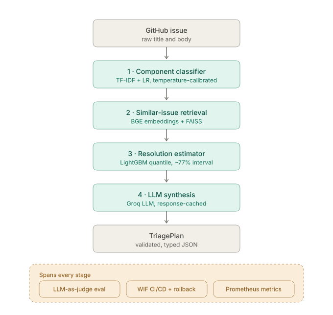

# TriageIQ

TriageIQ turns raw GitHub issues into structured triage decisions in about 5 seconds (production client p50 4.8 s on a warm instance, n=5 — see [Latency](#latency)). Given an issue title and body, it runs a four-stage ML pipeline — component classification, similar issue retrieval, resolution-time prediction, and LLM synthesis — and returns a JSON `TriagePlan` with predicted component, similar issues, expected resolution window, priority assessment, and suggested next steps. It is built on real issues from `microsoft/vscode` and `kubernetes/kubernetes` (what each model was actually trained or indexed on is itemised in [Training data](#training-data) — the supervised models see ~11K labeled issues, not the full corpus), deployed to Cloud Run, and built to demonstrate a full production ML lifecycle: evaluation, reproducible builds, Prometheus metrics, fail-closed auth, Workload Identity Federation CI/CD, and CVE-audited dependencies.



---

## Live API

**Base URL:** `https://triageiq-api-1014562031321.us-central1.run.app`

> Served from GCP project `triageiq-prod-260812` (region `us-central1`), a dedicated project under
> its own GCP identity, still under an IAM-scoped deploy identity with zero project-level grants.
> This is the second migration: the original project (`triageiq-portfolio-495022`) had its billing
> account closed (2026-08-05); the co-tenant stopgap that replaced it (`expense-tracker-498014`)
> then had ITS billing disabled too (2026-08-12), caught this time via CI failing rather than an
> undetected outage. Full rationale and the new billing-status monitoring added specifically to
> catch a third occurrence:
> [`docs/architecture/adr/0050-second-billing-outage-dedicated-project-migration.md`](docs/architecture/adr/0050-second-billing-outage-dedicated-project-migration.md).

```bash
# Service info
curl https://triageiq-api-1014562031321.us-central1.run.app/

# Triage an issue
curl -s -X POST https://triageiq-api-1014562031321.us-central1.run.app/triage \
  -H "Content-Type: application/json" \
  -d '{
    "repo": "microsoft/vscode",
    "title": "Editor crashes when opening large JSON files",
    "body": "VS Code becomes unresponsive on files > 50MB. Reproducible on 1.85.0, Windows 11. No workaround found."
  }' | python -m json.tool
```

**Supported repos:** `microsoft/vscode`, `kubernetes/kubernetes`  
**Rate limits:** 10 requests/hour, 30/day per IP. `/`, `/health`, and `/metrics` are not rate-limited.  
**Latency:** ~4.8s warm p50 end-to-end, ~41s cold start (measured; kept rare by a keep-warm monitor) — details, per-stage numbers and the n=5 caveat in [Latency](#latency).

---

## Architecture

```
POST /triage {repo, title, body}
        │
        ▼
┌───────────────────────────────────────┐
│ System 1: TF-IDF Component Classifier │  ~6ms p50 (prod, n=5)
│ One-vs-rest LogReg, 47 classes        │
│ vscode top-3 85.8% (top-1 70.0%)      │
│ k8s top-3 86.0% (top-1 54.8%)         │
└──────────────────┬────────────────────┘
                   │ top-3 component candidates + confidence
                   ▼
┌───────────────────────────────────────┐
│ System 2: Similar Issue Retriever     │  ~1.1s p50 (prod, n=5; mostly
│ BGE-base-en-v1.5 + FAISS cosine       │   CPU query embedding)
│ k8s related R@5 39.4% (clean eval)*   │
│ vscode dup R@5 53.5% (Lever1)         │
└──────────────────┬────────────────────┘
                   │ top-5 similar issues + similarity scores
                   ▼
┌───────────────────────────────────────┐
│ System 3: Resolution Time Predictor   │  ~53ms p50 (prod, n=5)
│ LightGBM quantile regression, 79 feats│
│ k8s +0.71% vs naive (as served)       │
│ vscode -54% (WORSE than naive)        │
└──────────────────┬────────────────────┘
                   │ p10/p50/p90 days estimate
                   ▼
┌───────────────────────────────────────┐
│ System 4: LLM Triage Assistant        │  ~3.1s p50 (prod, n=5)**
│ Groq openai/gpt-oss-120b              │
│ JSON TriagePlan with retry + fallback │
└──────────────────┬────────────────────┘
                   │
                   ▼
TriagePlan JSON: predicted_component, similar_issues,
expected_resolution_days, priority_guess,
suggested_next_steps, triage_summary
```

\*\* **System 4 is live again on `openai/gpt-oss-120b` (Groq).** Groq retired the original
`llama-3.1-8b-instant` on 2026-08-16; triage requests failed outright until the replacement was
selected, re-evaluated and deployed (production restored 2026-10-05 — see
[`docs/SESSION_RESUME_2026-08-30.md`](docs/SESSION_RESUME_2026-08-30.md); model choice:
[ADR-0054](docs/architecture/adr/0054-model-selection-underpowered-judge-mean.md)). A live
`POST /triage` on 2026-10-07 returned `_llm_status: ok`. The retired model's historical numbers
that remain in the long dated notes below are labeled with the model they were measured on.

\* k8s R@5 on a hand-verified clean eval subset — see the Evaluation table and note below;
the unfiltered number over the full eval population is lower (24.67%) because ~56% of that
population turns out to be structurally invalid as a retrieval test, not because the retriever
got worse.

---

## Evaluation

| System | Repo | Metric | Value |
|---|---|---|---|
| Component classifier (47-class retrain, ADR-0057) | vscode | **Top-3 accuracy (primary, multi-label — see note)**, n=423 fresh test rows | **85.82%** [82.17, 88.82] |
| Component classifier | vscode | Top-1 accuracy (secondary) | 69.98% [65.44, 74.15] |
| Component classifier | kubernetes | **Top-3 accuracy (primary, multi-label — see note)**, n=671 fresh test rows | **85.99%** [83.16, 88.41] |
| Component classifier | kubernetes | Top-1 accuracy (secondary) | 54.84% [51.06, 58.57] |
| Component classifier | vscode / kubernetes | Macro F1 (top-1) | 0.5165 / 0.4266 |
| Component classifier | vscode / kubernetes | Previous 28/35-class classifier on the SAME fresh test rows (top-3; the like-for-like comparator) | 68.09% [63.50, 72.35] / 83.61% [80.62, 86.22] |
| Component classifier | vscode | Retrain vs previous, paired, top-3 / top-1 | **+17.73pp** [+13.06, +22.40] / +15.37pp [+10.35, +20.38] (CIs exclude zero; 17.97% of test rows carry a label the old model could never emit) |
| Component classifier | kubernetes | Retrain vs previous, paired, top-3 / top-1 | +2.38pp [−0.56, +5.33] / −2.68pp [−6.68, +1.32] (**both CIs include zero: not distinguishable from the old classifier**; the retrain's gain is taxonomy coverage, 47 vs 35 classes) |
| Component classifier | both | Naive (majority/prior) baseline | **Not reported: no majority-class baseline is committed for the 47-class test split, and the split parquets are not in the repo to recompute it. Unverified; treat the table as lacking this row.** |
| Component classifier | both | Inference stage latency p50 (production, n=5) | 6.2ms |
| Similar issue retriever | kubernetes | **Recall@5, related task, clean eval subset (n=66, blind-labeled valid pairs only — see note)** | **39.39%** [27.3, 51.5] |
| Similar issue retriever | kubernetes | Recall@5, related task, unfiltered eval population (n=150, ~56% structurally invalid — see note) | 24.67% [18.0, 31.3] |
| Similar issue retriever | kubernetes | Recall@1 / @10 (related task, unfiltered, pre-Lever1/2 — not yet re-measured) | 9.3% / 23.3% |
| Similar issue retriever | vscode | **Recall@5, duplicate task (Lever1 only shipped, ADR-0040 — see note)** | **53.50%** [46.5, 60.5] |
| Similar issue retriever | vscode | Recall@1 / @10 (duplicate task, pre-Lever1 — not yet re-measured) | 27.0% / 59.5% |
| Similar issue retriever | vscode | Recall@5, related task (directional, n=19, post-Lever1 — see note) | 57.89% [36.8, 78.9] |
| Similar issue retriever | both | Stage latency p50 (production, n=5; dominated by CPU query embedding) | 1,108ms |
| Similar issue retriever | vscode | Index size (BGE, `index.faiss`, 13,315 vectors) | 40.9 MB |
<!-- RESOLUTION-ROWS: currently-SERVED state. After PR #150 deploys, k8s becomes: MAE 102.09d vs naive 104.23d (+2.06%); bucket +6.95pp [+5.55, +8.36]; raw Q10-Q90 coverage 83.26%; held-out conformal coverage (stored Q) 83.82%. Source: docs/DECISION_LOG_2026-10.md D17-D19, reports/resolution_train_serve_skew_2026-10-07.txt (variant B). vscode is unchanged by #150. -->
| Resolution predictor | kubernetes | Point estimate: MAE vs naive (**as served**: embedding features zero-filled — see note; n=2,992 re-split test) | 103.49d vs 104.23d naive (**+0.71%**) |
| Resolution predictor | kubernetes | Same model given the embedding features it was trained with (published number, ADR-0041; not what production computes today) | 101.98d vs 104.23d naive (+2.16%) |
| Resolution predictor | kubernetes | Bucket classifier: accuracy vs naive (**as served**, ADR-0041 re-split model) | +5.05pp [+3.94, +6.22] vs naive |
| Resolution predictor | kubernetes | Same, with training-time embedding features (published) | +6.35pp [+5.08, +7.55] vs naive |
| Resolution predictor | kubernetes | Raw Q10–Q90 interval coverage (target 80%, as served) / held-out conformal coverage with the stored Q | 80.48% / 80.81% (held-out n=2,095) |
| Resolution predictor | kubernetes | Stage latency p50 (feature build + 3 predictions; production, n=5) | 52.6ms |
| Resolution predictor | vscode | Point estimate: MAE vs naive (**as served**; the served model is the 2026-05-30 one, trained on 4,923 rows) | 5.45d vs 3.53d naive (**−54.2%, worse than naive**) |
| Resolution predictor | vscode | Same model with training-time embedding features (published) | 6.02d vs 3.53d naive (−70.5%, worse than naive) |
| Resolution predictor | vscode | Bucket classifier: served output (see note) | **naive-prior fallback** (~33% conf) — the raw classifier loses to naive by −22.08pp [−25.81, −18.02] (published, with embeddings) |
| Resolution predictor | vscode | Raw Q10–Q90 interval coverage (target 80%, as served, n=616) / CQR conformal coverage (held-out n=370) | 41.7% / 74.6% [69.9, 78.8] |
<!-- LLM-BASELINE-BLOCK (hand-copied from reports/eval_baseline.json; guarded by tests/test_api.py::test_eval_summary_judge_block_matches_committed_baseline). The k8s numbers will be re-derived after the k8s embedding fix (draft PR #150) is merged and the k8s cassette entries are re-recorded: update this block then. -->
| LLM synthesis (judge /15; synthesis `openai/gpt-oss-120b`, judge `qwen3:8b` local — ADR-0019/0061) | vscode | **Current mean, regression detector (cassette `f08e296d`, 2026-09-23)** | **12.27/15 (81.8%)**, n=11 |
| LLM synthesis | kubernetes | **Current mean, regression detector** | **11.87/15 (79.1%)**, n=53 |
| LLM synthesis | both | Overall mean | 11.94/15 (79.6%), n=64 |
| LLM synthesis | vscode / kubernetes | Floor-fail rate (judge's worst band on component or similar-issues) | 0.0% (0/11) / 5.66% (3/53) |
| LLM synthesis | vscode / kubernetes | Grounding check, ungrounded plans (**a consistency check, not an error rate — see note**) | 0.0% (0/11, report-only) / 1.89% (1/53, hard ratchet ≤1, ADR-0061) |
| LLM synthesis | vscode / kubernetes | Component picked by the LLM differs from classifier top-1 (report-only) | 9.1% (1/11) / 9.4% (5/53) |
| LLM synthesis | both | Plans whose component is wrong vs gold (n=64) | 20/64; 19 of those 20 still pass the grounding check |

Sources (all re-read by `readme_numbers_check.py` at PR time): classifier — `reports/classifier_old_vs_new_paired_2026-09-23.json`, `reports/multilabel_classifier_final_training.json`, [ADR-0057](docs/architecture/adr/0057-classifier-retrain-shipped-honest-comparable-baseline.md); retriever — `reports/lever12_eval_results.json`, `reports/track2_k8s_clean_eval.json`, `reports/d1_clean_eval_baseline.json`, the served `index.faiss` (`ntotal`, `MANIFEST.sha256`); resolution — [`reports/resolution_train_serve_skew_2026-10-07.txt`](reports/resolution_train_serve_skew_2026-10-07.txt) (= `docs/DECISION_LOG_2026-10.md` D17–D19), `reports/cqr_conformal_adjustments.snapshot.json`, `reports/w6_resolution_diagnosis.json`; LLM — `reports/eval_baseline.json`, `reports/eval_baseline_candidate_2026-09-23.json`, [ADR-0058](docs/architecture/adr/0058-gate-proof-and-ratchet-sizing.md), [ADR-0061](docs/architecture/adr/0061-baseline-2026-09-23-k8s-grounding-1-of-53.md); latency — [`reports/latency_replay_2026-10-07.txt`](reports/latency_replay_2026-10-07.txt). The live `/eval/summary` endpoint serves the judge and calibration blocks from the same files.

95% Wilson CIs shown in brackets where computed on a held-out test split (bootstrap CIs, 2000 resamples, seed 42, for resolution deltas and retrieval).

> **How to read the LLM rows.** The judge scores come from a single judge (`qwen3:8b`, run locally) on a 64-issue gold set (vscode n=11, k8s n=53) replayed from a recorded cassette, so CI runs make zero live LLM calls. n=11 gives vscode a wide band (the regression gate fires at −0.45 for vscode, −0.22 for k8s), and 1/53 vs 0/53 sits inside the same Wilson interval ([0.3, 9.9]% vs [0.0, 6.8]%, ADR-0061). The previous rows (10.26/15 k8s, 8.64/15 vscode, floor-fail 18.9% / 63.6%, fabrication 0/53) were measured with a different judge and the retired `llama-3.1-8b-instant` on a different gold set; they are **not comparable** and were removed from the table (they remain in git history and in the dated notes below). The classifier retrain moved the judge mean −0.156 (95% CI [−0.51, +0.20], n=64) against the voided pre-retrain run: no quality-improvement claim is made (ADR-0061).
>
> **What the grounding numbers count, and what they do not.** `fabrication_rate` and the grounding ratchet count plans where `grounding_status.all_grounded` is false: the predicted component is not in the classifier's own top-3, or a cited similar-issue number was not in the retrieved set. That is a **consistency check against the pipeline's upstream outputs, not a correctness check against gold labels**: 20 of the 64 plans predict a component that is wrong versus gold, and 19 of those 20 are scored "grounded" because the wrong guess still falls inside the classifier's top-3 (ADR-0058 addendum, `reports/eval_baseline_candidate_2026-09-23.json`). `1/53` and `0/11` must therefore not be read as error rates. The report-only metric that tracks the LLM overriding the classifier is `component_departed_from_top1_rate` (6 of 64 plans; all 6 wrong vs gold).
>
> **Resolution rows.** Production serves the ADR-0041 re-split k8s model and the 2026-05-30 vscode model, but serving never passed the embedding features (`emb_*`) the models were trained with, so they are zero-filled: a train/serve skew found 2026-10-07 (DECISION_LOG D17). Every previously published resolution metric (including this README's old 104.05d vs 106.29d, +2.1%, n=1,498, which belonged to the superseded 05-30 k8s model) was computed *with* embeddings; the "as served" rows are what a user gets today. The k8s fix is draft PR #150; vscode is deliberately left as is, because embeddings make its point estimate worse. vscode's point estimate is worse than predicting the training median; the product discloses this with a badge and serves the naive prior as its bucket. The vscode intervals are poorly calibrated: the raw Q10–Q90 interval covers 41.7% (nominal 80%) and the conformal adjustment only reaches 74.6% because the 2015–16 training window and the 2026 7-day test window violate exchangeability (`reports/cqr_conformal_adjustments.snapshot.json`; the mechanism behind the raw-interval gap was not diagnosed here). The k8s held-out conformal coverage of 80.81% uses the stored adjustment; the previously published 76.2% was measured on the superseded model (DECISION_LOG D19).

> **Reading order for the dated notes below.** They are a chronological record of what was reported and when; where a number in a note conflicts with the table above, the table wins (its sources are listed under it). Numbers attributed to `llama-3.1-8b-instant` or to the judge models used before 2026-09 are historical and not comparable to the current baseline.

> **2026-08-10 update — retrieval, resolution, and synthesis cutovers shipped (ADR-0040/0041/0043/0044), supersedes the retrieval/resolution/synthesis numbers in the notes below.**
> **Retrieval (ADR-0040):** two independent bugs fixed — corpus-side text was truncated at 512
> *characters* instead of BGE's real 512-*token* limit (dropped a median 78/165 tokens per
> truncated k8s/vscode issue), and BGE's model-card-documented query instruction prefix was
> never applied. Lever 1 (truncation fix) ships unconditionally for both repos. Lever 2 (query
> instruction) ships **on for k8s only** (`QUERY_INSTRUCTION_REPO_OVERRIDE`) — it's a
> significant additive win for k8s (+6.67pp) but directionally *negative* for vscode's
> duplicate-matching task, so shipping it uniformly would trade away a proven gain for config
> simplicity. Result: **k8s R@5 18.0%→24.67%** [18.0, 31.3], **vscode R@5 50.5%→53.5%**
> [46.5, 60.5]. Live-verified through the real, un-overridden `/triage` code path, not just a
> unit test. A follow-up investigation (2026-08-10,
> [`docs/investigations/vscode-retrieval-lexical-and-hybrid-2026-08-10.md`](docs/investigations/vscode-retrieval-lexical-and-hybrid-2026-08-10.md))
> tested whether near-duplicate/lexical-overlap dominance explains why the instruction helps
> k8s but hurts vscode — that specific hypothesis did not hold up; the asymmetry's real cause
> stays open. Hybrid BM25+dense fusion was re-tested against the corrected corpus and rejected
> again on both repos (dense-only remains stronger).
>
> **Retrieval, k8s eval-population audit (2026-08-11):** the 24.67% k8s number above measures
> R@5 over the full 150-pair eval population, but hand-categorizing a sample of its misses found
> most weren't retrievable-in-principle: umbrella/tracking issues that reference many unrelated
> sub-issues at once (no single embedding can be close to all of them), and citations where the
> target is background/precedent for a topic the query is actually about something else. Built a
> clean subset the honest way to avoid selection bias — **two exclusion criteria (checklist-style
> umbrella queries; causal-only references) were written down *before* any pair was scored
> against retrieval outcomes**, applied blind to hit/miss across all 150 pairs by 5 independent
> reviewers, and only *then* joined to the already-computed results. 66/150 pairs survive as a
> fair content-similarity test; **clean-subset R@5 = 39.39% [27.3, 51.5]**, CI lower bound above
> the unfiltered point estimate. Excluded pairs hit at 13.1% vs. valid pairs' 39.4% — reported as
> the check against selection bias (exclusion labels never saw the outcome, so this gap reflects
> the criteria's validity, not outcome-driven cherry-picking) rather than hidden. Full methodology
> and reproducible scripts:
> [`docs/investigations/2026-08-11-k8s-retrieval-ceiling-and-vscode-resolution-close.md`](docs/investigations/2026-08-11-k8s-retrieval-ceiling-and-vscode-resolution-close.md).
> Read: the prior "weak k8s retriever" framing was substantially an eval artifact, not a model
> quality problem — the unmodified BGE embedder is materially better than 24.67% suggested. The
> ~60% miss rate on the clean subset is still real headroom, not a solved problem.
>
> **Resolution (ADR-0041):** the shipped resolution models were trained on a stale split
> (regenerated 2026-05-30) against a corpus that had grown 99-100% since (regenerated
> 2026-07-11, Phase 2b). Re-splitting from the current corpus roughly doubles k8s's
> bucket-classifier gain over naive: **+3.27pp→+6.35pp** [+5.08, +7.55] (measured with the training-time embedding features; **as served today +5.05pp** [+3.94, +6.22], see the table notes), cutover and
> live-verified. Recency weighting added nothing on top (k8s's corpus is still entirely
> 2014-2016 in calendar time even with 100% more rows, so there's no recency signal to exploit).
> vscode's re-split was tried and **rejected** — it makes the bucket classifier dramatically
> worse (-24.73pp with recency weighting), so vscode's naive-prior fallback is unchanged.
>
> **Synthesis (ADR-0043):** ADR-0039 accepted a k8s synthesis-quality regression (-0.6226 vs.
> the frozen OLD baseline) as a side effect of the ADR-0036 classifier cutover, diagnosed as
> confidence-framing (tighter per-class confidence scores reading to the LLM as "the model is
> unsure," inducing hedged language). The retrieval and resolution fixes above are unrelated to
> that classifier and don't touch its confidence output — but re-running the full pipeline with
> both landed anyway **recovered 61% of the original gap**: k8s's judge mean moved
> 9.8868→**10.2642**/15. Per-dimension analysis confirms *why*: `similar_issues_relevance` and
> `resolution_estimate_reasonableness` (fed directly by the two fixes) recovered strongly or
> fully; `component_match` and `next_steps_actionability` (the two dimensions ADR-0037 traced
> specifically to confidence-framing) barely moved at all — exactly the causal signature you'd
> expect if both mechanisms are real and independent. **10.2642 is now the committed baseline**
> (`test_k8s_quality_regression`'s `xfail` marker removed) — the residual -0.2452 vs. OLD is a
> deliberately accepted cost of the classifier's verified ground-truth accuracy win, not an
> open item this gate tracks going forward. vscode: 8.7273→8.6364, flat within its own noise
> band. A follow-up probe (2026-08-10,
> [`docs/investigations/confidence-structural-representation-2026-08-10.md`](docs/investigations/confidence-structural-representation-2026-08-10.md))
> tested ADR-0037's last untested lever (showing the LLM less/differently-structured confidence
> information, not just different wording) — neither candidate cleared the bar for a full
> confirming run; one candidate introduced a new component-label fabrication failure mode the
> current prompt doesn't have. No further prompt-lever work is planned.
>
> **Fabrication rate promoted to a hard, zero-tolerance blocking gate (ADR-0044).** Previously
> informational; PR #57 promoted both `eval-gate.yml` jobs off `continue-on-error`, and ADR-0044
> then explicitly decided **not** to add per-repo slack (e.g. for vscode's small n=11 sample) —
> a discrete, replay-deterministic correctness signal (no live LLM call, confirmed
> byte-identical across replays) doesn't get the same statistical tolerance band as the
> continuous judge-score gate. As of 2026-08-10: 0/53 k8s, 0/11 vscode (the 2026-09-23 baseline reads 1/53 k8s, ADR-0061; this is a consistency check, not an error rate, see the table notes).
> Full reasoning: [`docs/architecture/adr/0040-retrieval-truncation-and-query-instruction.md`](docs/architecture/adr/0040-retrieval-truncation-and-query-instruction.md), [`docs/architecture/adr/0041-resolution-stale-split-recency-weighting.md`](docs/architecture/adr/0041-resolution-stale-split-recency-weighting.md), [`docs/architecture/adr/0043-combined-cutover-synthesis-quality-recovery.md`](docs/architecture/adr/0043-combined-cutover-synthesis-quality-recovery.md), [`docs/architecture/adr/0044-fabrication-rate-hard-gate-bound.md`](docs/architecture/adr/0044-fabrication-rate-hard-gate-bound.md).
>
> **Headline finding (2026-07-19, final framing per ADR-0033, supersedes the 2026-07-16
> framing below): retrieval quality is now measured on a clean, hand-verified, disjoint
> eval set — and it's honestly weaker than previously reported, not better.** k8s's clean
> product-task R@5 (issue → related issue, its only available task — vscode has a
> duplicate-comment channel k8s never had) is **9.3% [5.3, 14.0]** (n=150,
> hand-verified genuine by construction) — down from the previously-reported 23.5%, which
> was itself measured on a gold set later found to be title_sim-contaminated (ADR-0032).
> Two factors plausibly explain the drop, not fully disentangled: cleaner (harder, less
> lexically-inflated) pairs, and a ~2x larger candidate corpus (30,000 vs. the old index's
> 15,000) that mechanically lowers recall. **vscode reverses its "unmeasured" status**:
> its `dup_comment` channel — never precision-audited before ADR-0033 — turned out to be
> vscode's largest, cleanest channel (85% precision, n=2,242), giving a properly powered
> duplicate-task R@5 of **43.5% [37.0, 50.5]** (n=200). vscode's separate related-issue
> task (non-duplicate) stays underpowered (n=19, directional only, reported but never
> gated) — vscode is genuinely two different tasks, reported separately, never blended.
> Full reasoning: [`docs/architecture/adr/0033-clean-retrieval-data-trustworthy-eval.md`](docs/architecture/adr/0033-clean-retrieval-data-trustworthy-eval.md).
>
> **Harness correction (2026-07-24, ADR-0035, supersedes the 2026-07-23 framing below) —
> three measurement bugs found and fixed; the corrected picture is weaker-but-real baselines
> and NO SIGNAL from fine-tuning, not a confirmed regression.** GG's call after five
> independent retrieval-improvement techniques all failed: "stronger evidence of a broken
> harness than of a uniquely hard task." The audit found (1) every eval query was **title-only**
> while production embeds title+body untruncated (`triage.py`) — eval-set JSON never populated
> `query_body`; (2) the D2 fine-tune trained/saved **mean pooling** against BGE-base's native
> **CLS-token pooling**; (3) training truncated at 128 tokens, cutting **65.73%** of examples
> (measured token-length p95=230, corrected to 256); (4) all three ADR-0031 levers were measured
> against an unaudited, pre-D1 pair population (277/292 pairs, only 72%/20% hand-verified
> genuine) instead of D1's clean, disjoint eval sets. **Corrected canonical baselines: k8s R@5
> 9.3%→18.0% [12.0, 24.0], vscode R@5 43.5%→50.5% [43.0, 57.5]** (both nearly double/gain 7pts
> — production was always this good, only the measurement undersold it). **All four ADR-0031
> levers are still rejected** on the corrected harness, but **weighted fusion flipped sign** —
> originally reported as marginally shipping (+3.25pp k8s, +4.11pp vscode, both CIs excluding
> zero), it's now flat on k8s and a **significant vscode regression** (−8.0pp, CI [−13.5,−3.0]).
> BM25-alone (newly measured) is the *weaker* system on both repos, not a diluted strong
> signal. **The D2 fine-tune conclusion is WITHDRAWN**: re-run with both bugs fixed, the result
> is **+2.0pp R@5 (50.5%→52.5%), CI [−4.5, +8.5]** — every metric moved positive (a full sign
> reversal from the withdrawn "confirmed regression"), but no CI excludes zero. At n=200 the CI
> half-width is ≈±6.5pp — **this is underpowered, not disproven**; whether more data or
> different hyperparameters would show a real, detectable lift is genuinely open. Still
> flagged, not fixed: corpus/query truncation asymmetry (512 vs. untruncated), BGE's unused
> query instruction prefix, BM25 tokenization uninspected. Nothing in production changed —
> confirmed the served index and model are untouched throughout. Full reasoning:
> [`docs/architecture/adr/0035-retrieval-harness-correction.md`](docs/architecture/adr/0035-retrieval-harness-correction.md).
>
> **D2 fine-tune result (2026-07-23, ADR-0034 — historical, WITHDRAWN above, kept for
> provenance): confirmed regression, BGE-base off-the-shelf stays the shipped retriever.**
> D1's clean, disjoint vscode_duplicate data (1,734 training pairs, leakage guard PASSED
> 0-overlap on every run) was fine-tuned locally (BGE-base, MNRL loss, measure-first single
> run: 5 epochs, lr=2e-5). Result: **R@5 38.5% vs. the 43.5% baseline (−5.0pp, CI [−11.0,
> +0.5])** — every metric moved backward. A diagnostic leg then tested the leading alternative
> explanation (overfitting) directly: 2 epochs, lr=1e-5 — the textbook anti-overfit fix, ending
> training at a 5.7× higher, far-less-memorized loss (0.255 vs. 0.045). If overfitting were the
> cause, this should have recovered some of the gap. Instead **R@5 dropped further to 33.5%
> (−10.0pp, CI [−16.0, −4.5], excludes zero)** — reported at the time as a statistically
> confirmed regression. **This reasoning is now known to be wrong** (ADR-0035, above): both
> runs trained with mean pooling against BGE's native CLS pooling and truncated 65.73% of
> training examples at 128 tokens — the diagnostic leg never isolated either confound, so it
> could not have ruled out overfitting as *the* mechanism. Kept here for historical accuracy
> of what was reported and when; superseded finding is above. Original ADR:
> [`docs/architecture/adr/0034-d2-retrieval-finetune-honest-negative.md`](docs/architecture/adr/0034-d2-retrieval-finetune-honest-negative.md).
>
> **Prior framing (2026-07-16, ADR-0030/0031/0032 — historical, superseded above): k8s
> product-task retrieval is genuinely weak, hand-verified; vscode product-task retrieval is
> currently UNMEASURED.** k8s Recall@5 on the actual product task ("given a new issue, find
> related issues"), against the actually-deployed live index: **23.5% [18.4, 28.5]** (n=277) —
> the lowest absolute score of any model in this system's per-model audit (classifier top-3
> 82.5%/90.4%, resolution's real k8s bucket gains, synthesis's floor-fail rates). A
> hand-judged precision audit (ADR-0032) confirms this number is real, not eval noise: 72%
> of the underlying gold pairs are genuinely related, and pulling the incidental 28% out
> doesn't move Recall@5 outside its own confidence interval. Three untried,
> zero-training improvement levers were then tried against it and **all three failed to
> clear the bar** (ADR-0031): hybrid BM25+dense fusion (CI crosses zero), a pretrained
> cross-encoder reranker (quality regresses on both repos, +190-330x latency), and a
> stronger pretrained embedder (CI crosses zero). The earlier "vscode is statistically
> indistinguishable from k8s, both ~23-27%" framing was retired: the same precision audit
> (ADR-0032) found vscode's gold pairs were only 20% genuinely related (94.9% sourced from
> an unaudited title-similarity channel, dominated by blank-template and
> generic-crash-title collisions). Full reasoning:
> [`docs/architecture/adr/0030-phaseC-product-task-feasibility.md`](docs/architecture/adr/0030-phaseC-product-task-feasibility.md),
> [`docs/architecture/adr/0031-retrieval-quality-improvement.md`](docs/architecture/adr/0031-retrieval-quality-improvement.md),
> [`docs/architecture/adr/0032-product-task-gold-pair-quality-audit.md`](docs/architecture/adr/0032-product-task-gold-pair-quality-audit.md).
>
> **Classifier metric correction (2026-07-11).** The product never surfaces a single
> label — `triage.py` builds `classifier_top3` and `grounding.py::verify_plan_grounding`
> defines a correct prediction as top-3 membership, not top-1 equality. Reporting only
> top-1 materially understated the classifier's real-world usefulness (a 21–31pp gap,
> non-overlapping CIs, same model + test split — no retraining involved). Additionally,
> 30.4% of the kubernetes test set and 8.0% of vscode's have more than one valid
> component label that gets collapsed to one at preprocessing time; crediting a
> prediction that hits any valid label (not just the collapsed one) raises accuracy
> further to 59.4% (k8s) / 71.7% (vscode) top-1. Full methodology:
> [`reports/model_eval_audit.json`](reports/model_eval_audit.json) → `component_classifier`.
>
> **DistilBERT dismissal correction (2026-07-24).** `05_train_distilbert.py`'s architecture
> comparison was dismissed as "TF-IDF latency and accuracy were sufficient at this data
> scale" — using **top-1**, the exact metric the correction above found was the wrong one
> to evaluate this classifier on. Re-evaluated the existing trained artifacts (no
> retraining) at top-3, the product's real correctness definition: **DistilBERT loses on
> both repos** — 88.2% vs. TF-IDF's 90.4% (vscode) and 74.5% vs. 82.5% (k8s, an 8pp gap) —
> despite appearing to *win* on vscode's top-1 (75.4% vs. 69.0%), which is what the original
> dismissal cited. Same wrong-metric error class as the retrieval corrections
> (ADR-0035): a comparison decided on a metric the product doesn't use. Calibration and
> latency were also materially worse (ECE 0.40 vs. 0.14 vscode; CPU p50 97.7ms/197.2ms vs.
> TF-IDF's ~5ms) — TF-IDF+LR remains the shipped classifier, now for a corrected reason.
> Full numbers: [`reports/distilbert_results_top3_corrected.json`](reports/distilbert_results_top3_corrected.json).
>
> **Multi-label supervision fix SHIPPED (2026-07-24, ADR-0036) — same TF-IDF+LR architecture,
> corrected supervision.** `preprocess.py::normalize_labels()` keeps only the first matching
> component label per issue, discarding the rest — 30.4% of k8s test issues / 8.0% of
> vscode's genuinely have more than one. Retrained as one-vs-rest logistic regression over
> ALL valid labels (same TF-IDF features, only the supervision changes): **k8s top-3
> 82.5%→87.1% (+4.55pp, CI [+0.35,+8.39], excludes zero)**, vscode top-3 flat (90.4%→89.8%,
> ceiling + smaller collapse rate) but **top-1 improves significantly on both repos**
> (k8s +9.09pp, vscode +7.49pp, both CIs excluding zero) — consistent direction across three
> independent CIs, unlike ADR-0031's rejected weighted-fusion result (marginal + inconsistent
> direction across repos). Recalibrated (temperature scaling generalized to OvR's independent
> per-class logits, argmax-preserving, verified empirically): ECE improves on both repos
> (0.086→0.053 vscode, 0.111→0.090 k8s) and k8s's new overconfidence (a real risk the naive
> calibration objective first made *worse*, caught before shipping) is corrected. The
> selective-prediction abstention gate's fixed thresholds (ADR-0021, off by default) are now
> stale against this new confidence distribution — documented, not silently left dead. **Note:**
> displayed `component_confidence` values run structurally higher post-cutover (independent
> per-class sigmoids vs. a competing 35-way softmax, e.g. 0.221→0.391 for a comparable
> prediction) — a scale change, not increased model certainty; ECE confirms the new numbers are
> equally or more honest. Full reasoning:
> [`docs/architecture/adr/0036-classifier-multilabel-supervision-fix.md`](docs/architecture/adr/0036-classifier-multilabel-supervision-fix.md).
>
> **Retriever metric correction (2026-07-11).** The advertised vscode Recall@5 (36.7%)
> was measured against `data/gold_related.parquet` (v1), which is only 74.0% genuine
> issue→issue pairs — the rest are PR→issue or duplicate-comment pairs, an easier proxy
> task the product doesn't perform. The next candidate honest number, measured against
> the actually-deployed live index, was 26.7% [21.6, 31.9] — a ~10pp inflation, CIs do not
> overlap. (This superseded ADR-0028's originally-reported 22.4% [17.7, 28.0] — n=254,
> ADR-0031 (2026-07-12) found no committed script ever reproduced that number and its
> denominator didn't match the full product stratum; 26.7%/n=292 is the byte-reproducible
> number via `scripts/phaseC_vscode_live_product_eval.py`.) **This 26.7% number was itself
> retired five days later (ADR-0032, below) — it wasn't a wrong computation, but a
> computation against a gold set later found to be ~80% incidental.**
>
> **k8s retriever re-eval (2026-07-12, ADR-0030).** kubernetes was first reported as
> "unmeasurable" (zero product-task pairs land in the *test-split* of the live corpus).
> That framing was wrong: the live-serving retriever is an off-the-shelf pretrained
> `BAAI/bge-base-en-v1.5` checkpoint, never trained on any gold pair — only a separate,
> unshipped fine-tuned artifact is — so the train/val/test split (built to prevent
> leakage for *that* fine-tune) carries zero leakage risk for the live model. Every
> product-task pair whose query and target both fall in the live index's number range
> is usable for measurement regardless of split label: 277 of 776 pairs, evaluated with
> the same method and bootstrap CI as vscode's number above
> (`scripts/phaseC_k8s_live_product_eval.py`) — see the headline finding above for the
> result. A W3 fine-tune was evaluated against both a proxy gate task and the product task
> (`docs/architecture/adr/0027-w3-retry-stratified-eval.md`): proxy-task gains were real
> and significant (k8s +14.3pp, vscode +4.6pp) — this gate stratum is unaffected by the
> gold-pair-quality finding below (ADR-0032 Finding 4: it's sourced from PR-query/
> dup_comment pairs, not the contaminated `title_sim` channel). Product-task gains were
> directionally positive and underpowered on both repos (k8s +3.5pp, vscode +3.2pp, both
> CIs cross zero) — **held, and stays held on both repos, per
> `docs/architecture/adr/0030-phaseC-product-task-feasibility.md`: NO-GO on mining more
> product-task pairs to gate either fine-tune, decided on value, not feasibility.** k8s's
> data ask was disproportionate anyway (~6,075 pairs, ~8x the current stratum), but
> that's not the operative reason — proving a ~3.5pp lift on top of a 23.5% base rate
> would still ship a retriever that misses the related issue 3 times out of 4. vscode's
> data gap is smaller and closeable (~664 more pairs), but closing it would only prove a
> +3.2pp lift against a ~23-27% base rate — the same weak-baseline problem, just with an
> easier data path. Neither fine-tune is a near-miss awaiting data; both are marginal
> against a weak baseline.
>
> **Retrieval-quality-lever pass (2026-07-12, ADR-0031).** Hybrid BM25+dense fusion, a
> pretrained cross-encoder reranker (the ADR-0006 retry against the corrected metric), and
> a stronger pretrained embedder were each tried against the product-task R@5 bar. All
> three rejected — see the headline finding above and
> [`docs/architecture/adr/0031-retrieval-quality-improvement.md`](docs/architecture/adr/0031-retrieval-quality-improvement.md)
> for full per-lever results. The two remaining paths (in-domain fine-tuning, which
> reopens the leakage question ADR-0030 deliberately kept closed; or new related-pair
> mining, already NO-GO'd on value grounds) are both harder and were explicitly deferred,
> not attempted here.
>
> **Gold pair quality audit (2026-07-16, ADR-0032) — k8s confirmed real, vscode retired
> and marked unmeasured.** Before accepting ~23-27% as a ceiling, a hand-judged 50-pair
> sample (25/repo, fixed seed) checked whether the gold pairs behind these R@5 numbers
> are genuinely related. **k8s: 72.0% precision [52.4, 85.7]** — the pair set is 86%
> reference-mined ("See #N"/"Forked from #N"), and pulling incidental pairs out doesn't
> move R@5 outside its own CI (27.8% genuine-only vs. 23.5% full-set) — **the k8s finding
> holds up as real**, and stands as this project's headline retrieval number (above).
> **vscode: 20.0% precision [8.9, 39.1]** — 94.9% of its live-evaluated pairs come from
> `title_sim` (title-text similarity), a channel never precision-audited before, and the
> sample is dominated by boilerplate-template collisions ("Bayou"↔"11", both blank issue
> forms) and generic auto-bucket title matches on different actual bugs. **Conclusion:
> vscode's 26.7% is retired, not caveated** — it was measuring a ~80%-incidental gold set,
> not retrieval quality. vscode product-task retrieval is reported as **UNMEASURED** above
> and in the eval table, not as a number with an asterisk; no properly-powered clean
> re-measurement exists yet (the genuine-only subsample, n=5, is too small to read).
> Separately: of the genuinely-related pairs the retriever misses, 0/17 have zero shared
> vocabulary with their target (overlap up to 90 shared tokens on near-duplicate crash
> reports) — misses are lexically findable in principle, not an unfindable-by-any-method
> ceiling, for the k8s finding above. **Broader caution:** `title_sim` isn't scoped to this
> eval — it also feeds the (HELD, unshipped) W3 fine-tune's hard-negative mining, its
> train/val split, and its own training and val-monitoring data; the fine-tune's primary
> CI-gated metric (the `gate` stratum) is unaffected (PR-query/`dup_comment`-sourced, not
> `title_sim`), but any future revival of that fine-tune thread should re-audit or exclude
> `title_sim` pairs first. Full methodology, every pair's judgment, and the full consumer
> trace:
> [`docs/architecture/adr/0032-product-task-gold-pair-quality-audit.md`](docs/architecture/adr/0032-product-task-gold-pair-quality-audit.md).
>
> **Synthesis quality metric redesign (2026-07-11).** The mean-band score is a
> *regression detector* (fails only if it drops below its own prior baseline by more
> than measured noise) — it was never a quality floor, and it structurally cannot catch
> fabrication: the judge scores the final `TriagePlan` JSON but never sees
> `classifier_top3` or the retrieved-issue set. Direct proof: a known hallucinated
> component (vscode issue #311836) scored 9/15 — *above* its own repo's 8.36/15 mean.
> Two new metrics close this gap, both computed with zero additional LLM calls
> (reused from signals the pipeline already produces): **floor-fail rate** (fraction of
> plans hitting the judge's own worst band — `component_match==0` or
> `similar_issues_relevance==0`) is reported here *alongside* the mean rather than
> averaged away — vscode's 45.5% floor-fail rate is invisible behind its
> passable-looking 55.8% mean. **Fabrication rate** promotes the existing deterministic
> grounding check (`grounding.py::verify_plan_grounding`) from informational-only to a
> named quality signal — currently reported informationally
> (`eval/test_quality_regression.py`'s CI job is non-blocking) pending an observation
> window before any promotion to a hard gate. The mean-band gate itself is unchanged.
>
> **Resolution reporting correction (2026-07-11).** This is the one model where the
> hard modeling/gating work (ADR-0009/0010/0021/0023/0025) was already rigorous and
> live-correct — the numbers above were stale (a 2026-05-30-era snapshot) and the
> table conflated the point-estimate and bucket-classifier outputs, which are two
> separate signals with separate gates. k8s: both the point estimate and the bucket
> classifier genuinely beat naive, CIs excluding zero. vscode: the point estimate
> (MAE) is served as-is despite losing to naive (−70.5%) — there's no fallback gate for
> the point/interval, only a transparency badge; the bucket classifier's raw output
> *does* have a trust gate (`BUCKET_CLASSIFIER_TRUSTED`, ADR-0025) and, because it loses
> to naive by −22.08pp, is not served — vscode's `resolution_bucket` field is the naive
> majority-class prior, honestly labeled low-confidence. Both losing numbers were
> already correctly reported internally (`reports/w6_resolution_diagnosis.json`); they
> just never reached this README, and a transcription error in ADR-0025's own table
> and a proxy-conflated prose note in `reports/eval_summary.json` (citing the point
> estimate's −70.5% while describing the bucket classifier's rejection reason) are also
> fixed alongside this.

Full evaluation reports: [`reports/`](reports/)

---

## Training data

What each model actually saw (the old "~20K issues" figure did not describe any one of these):

| Model | microsoft/vscode | kubernetes/kubernetes | Source |
|---|---|---|---|
| Component classifier (TF-IDF + one-vs-rest LogReg, 47 classes) | 4,226 labeled issues (train 3,380 / val 423 / test 423) | 6,710 labeled issues (train 5,368 / val 671 / test 671) | [ADR-0056](docs/architecture/adr/0056-eval-gold-taxonomy-broader-than-classifier-label-space.md); test sizes re-read from `reports/classifier_old_vs_new_paired_2026-09-23.json` |
| Resolution predictor (LightGBM) | 4,923 training rows (created 2015-10 to 2016-04) | 23,928 training rows (created 2014–2016, ADR-0041) | `PCA.n_samples_` of the served `resolution_predictor_*.pkl` (hashes in `data/models/MANIFEST.sha256`) |
| Similar-issue retrieval index (BGE-base-en-v1.5, off-the-shelf, **not fine-tuned**) | 13,315 indexed issues | 29,994 indexed issues | `index.faiss` `ntotal` of the served indexes |

The 29,994 figure is the **k8s retrieval index size**, not a training-set size: no model is trained on it. The supervised models see ~11K labeled issues (4,226 + 6,710) plus the resolution rows above. The k8s corpus covers 2014–2016 in calendar time, so live issues arrive about ten years after the data the resolution model learned from.

## Latency

Measured against the production URL on 2026-10-07 after PR #137 (revision `15ef0b3`), five sequential real `/triage` calls (3 vscode, 2 k8s) to one warm instance. **n=5: medians are indicative; the p95 is just the max.** Raw output: [`reports/latency_replay_2026-10-07.txt`](reports/latency_replay_2026-10-07.txt).

| Metric | Before #137 | After #137 |
|---|---|---|
| End-to-end client p50 | 5,977 ms | **4,834 ms** (max 6,976 ms) |
| Server total (median) | 4,772 ms | 4,232 ms |
| Stage 1 classifier (median) | 8.6 ms | 6.2 ms |
| Stage 2 retrieval, incl. CPU query embedding (median) | 1,008 ms | 1,108 ms |
| Stage 3 resolution (median) | 586 ms | **52.6 ms** |
| Stage 4 LLM synthesis, Groq `openai/gpt-oss-120b` (median) | 2,842 ms | 3,060 ms |

#137 removed per-request work from stage 3: the k8s resolution stage went from 3.0–3.3 s to 53–65 ms and the vscode stage from 536–586 ms to 37–77 ms (same replay files). The LLM call and query embedding now dominate; stage-2 and stage-4 medians are within the noise of n=5.

**Cold starts.** The service runs with `min-instances 0`. A cold start (model, FAISS and predictor load) takes a median ~41 s from "Started server process" to "Application startup complete" (n=303 cold starts logged 2026-09-05 to 2026-10-05, range 21–73 s; `reports/latency_replay_2026-10-07.txt`). Since the external keep-warm monitor started (2026-10-05 12:40 UTC) cold starts fell from 6–11 per day to 1 on 2026-10-06 and 0 on 2026-10-07 (to 12:21 UTC), counted from Cloud Run logs (`docs/DECISION_LOG_2026-10.md` D10 in the Phase 5 section). If the monitor stops, the first request after idle pays the full cold start.

---

## Tech Stack

| Layer | Technology |
|---|---|
| API | FastAPI + Uvicorn on Cloud Run |
| Classification | scikit-learn TF-IDF + Logistic Regression |
| Embeddings | `sentence-transformers` BAAI/bge-base-en-v1.5 |
| Retrieval | FAISS (cosine, CPU) |
| Prediction | LightGBM quantile regression |
| LLM | Groq `openai/gpt-oss-120b` (replaced the retired `llama-3.1-8b-instant`, 2026-10-05; see note under System 4 above); eval judge: local `qwen3:8b` via Ollama |
| Config | pydantic-settings |
| Observability | Prometheus + prometheus-fastapi-instrumentator; GitHub Actions health monitor + external UptimeRobot (see [Monitoring](#monitoring)); no Cloud Monitoring alert policies |
| CI | GitHub Actions: ruff, mypy, pip-audit, pytest (352 tests, 78.04% coverage, gate at 60%), dependabot |
| CD | GitHub Actions + Workload Identity Federation + Artifact Registry + Cloud Run |

---

## Local Development

### Prerequisites

- Python 3.11+
- A [Groq API key](https://console.groq.com) (free tier works)

### Setup

```bash
git clone https://github.com/gaurav-gandhi-2411/triage-iq.git
cd triage-iq

pip install torch --index-url https://download.pytorch.org/whl/cpu
pip install -r requirements-dev.txt
pip install -e .

export GROQ_API_KEY=your_groq_key
```

> The API requires trained model artifacts in `data/models/` to serve `/triage`. Tests mock the model store so they run without artifacts.

### Run tests

```bash
pytest tests/
# With coverage:
pytest tests/ --cov=src/triage_iq --cov-report=term-missing
```

### Run the server locally

```bash
uvicorn triage_iq.api.app:app --reload
# → http://localhost:8000
```

---

## Retraining from Scratch

Scripts are numbered in execution order. Run from the repo root with `GITHUB_TOKEN` set for scraping.

```bash
python scripts/01_scrape_issues.py        # scrape from GitHub API
python scripts/02_preprocess.py           # clean bodies, extract features
python scripts/03_split.py                # temporal train/val/test splits
python scripts/04_train_classifier.py     # original single-label TF-IDF classifier (superseded: the shipped
                                          # 47-class model is 13_train_multilabel_classifier.py + calibrate_multilabel_classifier.py)
python scripts/07_extract_related_pairs.py   # extract related-issue pairs for training/eval
python scripts/08_build_similar_issue_index.py # BGE+FAISS index
python scripts/09_train_resolution.py     # LightGBM resolution predictor
python scripts/10_curate_triage_gold.py   # gold triage examples for eval
python scripts/11_evaluate_triage.py      # full pipeline evaluation

# Optional: verify LLM priority calibration against test cases
python scripts/11b_verify_priority_calibration.py
```

> Scripts `05_train_distilbert.py` and `06_eval_llm_fewshot.py` explored alternative architectures that are not used in the production pipeline — DistilBERT loses to TF-IDF+LR on the product's real metric (top-3), on both repos; see the DistilBERT dismissal correction note above for the corrected numbers and why the original top-1-based dismissal was measuring the wrong thing.

After retraining, upload artifacts to GCS:

```bash
gsutil -m cp data/models/component_classifier_*.pkl gs://triageiq-prod-260812-models/models/
gsutil -m cp data/models/resolution_predictor_*.pkl gs://triageiq-prod-260812-models/models/
gsutil -m cp -r data/models/similar_issue_index_*_bge gs://triageiq-prod-260812-models/models/
gsutil -m cp data/processed/*_temporal_train.parquet gs://triageiq-prod-260812-models/processed/
```

---

## API Reference

### `GET /`

Service discovery. No auth required. Returns name, version, and endpoint links.

### `POST /triage`

Rate-limited: 10/hour, 30/day per IP.

**Request body:**

| Field | Type | Required | Notes |
|---|---|---|---|
| `repo` | string | Yes | `"microsoft/vscode"` or `"kubernetes/kubernetes"` |
| `title` | string | Yes | 1–512 chars |
| `body` | string | No | Up to 32,000 chars; truncated to 800 in LLM prompt |
| `issue_number` | int | No | Excludes self from similar-issue search |
| `created_at` | ISO 8601 | No | Defaults to request time if omitted |

**Response fields:** `predicted_component`, `component_confidence`, `similar_issues[]`, `expected_resolution_summary`, `expected_resolution_lower_days`, `expected_resolution_upper_days`, `priority_guess` (`low`/`medium`/`high`), `priority_rationale`, `suggested_assignee_class`, `suggested_next_steps[]`, `triage_summary`, `_request_id`, `_llm_status`.

`_llm_status` values: `ok` | `parse_retry_succeeded` | `parse_failure` (degraded fallback plan, component from TF-IDF only).

**Errors:** 422 unsupported repo or missing title. 429 rate limit. 500 internal error.

### `GET /health`

Returns `{"status": "ok", "repos_loaded": [...], "groq_key_present": bool, "uptime_s": float, "dependencies": null}`. `GET /health?deps=1` additionally checks the model store and makes one zero-token authenticated Groq call (503 if either is unhealthy); the keep-warm monitor uses the bare `/health`.

### `GET /metrics`

Prometheus text format. Auth behavior — see [Monitoring](#monitoring).

**Interactive docs:** `/docs` (Swagger UI, auto-generated).

---

## Configuration

All values from environment variables or `.env` file. Managed by `src/triage_iq/config.py`.

| Variable | Required | Default | Description |
|---|---|---|---|
| `GROQ_API_KEY` | **Yes** | — | Groq API key. Empty string raises `ValidationError` at startup. |
| `ENVIRONMENT` | No | `prod` | `dev` / `test` / `prod`. Controls `/metrics` fail-closed behavior. |
| `METRICS_TOKEN` | No | — | Bearer token for `/metrics`. Unset in prod → 503 (fail-closed). |
| `DATA_DIR` | No | `<repo-root>/data` | Path to `models/` and `processed/` subdirectories. |
| `PORT` | No | `8080` | Uvicorn listen port (Cloud Run sets this automatically). |
| `LOG_LEVEL` | No | `INFO` | Python logging level. |
| `RATE_LIMIT_ENABLED` | No | `true` | Set `false` to disable rate limiting (tests use this). |
| `LLM_CACHE_ENABLED` | No | `false` | Set `true` to enable the SQLite LLM response cache. |
| `LLM_CACHE_PATH` | No | `<repo-root>/data/llm_cache.sqlite` | Path to the SQLite cache DB. |

### Response cache

An opt-in SQLite-backed cache (`LLM_CACHE_ENABLED=true`) stores LLM responses
keyed on SHA-256 of the canonical request (provider + model + messages + temperature +
max\_tokens). Cache hits are returned in <5 ms without a Groq call.

Useful for:
- Eval re-runs: a 64-issue re-run against a warm cache costs 0 Groq tokens for triage
  and near-0 for judge calls.
- Development loops: identical `/triage` requests during testing skip the LLM.

Admin: `python scripts/13_cache_admin.py stats|clear|clear-provider|clear-model`.

On Cloud Run the cache is per-instance (ephemeral disk); each cold start begins empty.
This is acceptable for Stage A — warmup is fast and correctness never depends on the cache.

---

## Deployment

CD pipeline: `.github/workflows/deploy.yml`, triggered on every push to `main`.

### Steps

1. Authenticate to GCP via Workload Identity Federation (no static SA key in GitHub)
2. Download production models from GCS
3. Build Docker image from `docker/Dockerfile.prod` (CPU PyTorch, BGE model pre-baked, installs from `requirements.lock`)
4. Push to Artifact Registry
5. Deploy to Cloud Run with `GROQ_API_KEY` + `METRICS_TOKEN` injected from Secret Manager
6. Smoke test `/health`, `/metrics`, `/triage` — auto-rollback to previous revision on failure

### WIF setup (one-time)

```bash
bash scripts/setup_wif.sh
# Prints GCP_WIF_PROVIDER → add as GitHub repository variable
# Settings → Secrets and variables → Actions → Variables tab
```

### Lock file regeneration

```bash
# Must run on Linux for correct wheel hashes
docker run --rm -v "$PWD":/src -w /src python:3.11-slim \
  pip-compile requirements.txt --output-file=requirements.lock --no-header --no-annotate
```

### Manual redeploy

Trigger via GitHub Actions UI: `Actions → Deploy to Cloud Run → Run workflow → Branch: main`.

---

## Monitoring

### Prometheus metrics

```bash
curl https://triageiq-api-1014562031321.us-central1.run.app/metrics \
  -H "Authorization: Bearer $METRICS_TOKEN"
```

Auth behavior:
- `METRICS_TOKEN` set → requires `Authorization: Bearer <token>` (401 otherwise)
- No token + `ENVIRONMENT=prod` → 503 (fail-closed, prevents silent exposure)
- No token + `ENVIRONMENT=dev` → open (local dev only)

### Uptime, keep-warm and alerting (decision, not an open gap)

| Layer | What it does | Evidence |
|---|---|---|
| GitHub Actions health monitor (`.github/workflows/health-monitor.yml`) | `GET /health?deps=1` (model store + one zero-token Groq call), fails loudly on anything but 200 + `status=ok`. Scheduled every 30 min, but GitHub runs it irregularly: the last 8 runs (2026-10-05 to 2026-10-07) were 3–7 h apart, so treat the detection window as hours | `gh run list --workflow=health-monitor.yml` |
| External UptimeRobot monitor (free plan, 5-minute interval, bare `/health`) | Uptime check **and** keep-warm: first ping 2026-10-05 12:39:50 UTC; cold starts fell from 6–11/day to 1 (2026-10-06) and 0 (2026-10-07) | `docs/DECISION_LOG_2026-10.md` D10 (Phase 5), Cloud Run request logs |
| Cloud Monitoring alert policies / uptime checks | **Not adopted.** Alerting could not be verified to be free, and this project runs on a zero-spend rule. A read-only `gcloud monitoring policies list` and `uptime list-configs` against `triageiq-prod-260812` on 2026-10-07 returned no policies and no uptime checks | owner decision; `scripts/setup_monitoring.sh` is kept as a reference for a future paid setup, **not** applied |

UptimeRobot currently sends `HEAD` first (the API answers 405) and then `GET`; switching the monitor to `GET` is queued in `docs/QUEUE_FOR_GG.md`.

### Log filtering (Cloud Logging)

```
jsonPayload.log_type="access"                                      # all access logs
jsonPayload.log_type="access" AND jsonPayload.status="error"       # failed requests
jsonPayload.log_type="access" AND jsonPayload.llm_status="parse_failure"  # LLM degraded
```

---

## Known Limitations

**Priority calibration.** (Measured on the retired 8B `llama-3.1-8b-instant`; not re-verified for the current `gpt-oss-120b`.) The 8B model could be steered away from a prior "high" bias using PRIORITY GUIDELINES in the system prompt, but cannot reliably distinguish "edge-case + workaround → low" from "core regression + workaround → medium" when both have workarounds. Resolving this requires fine-tuning, a larger model, or rule-based post-processing. See [`reports/06_triage_assistant.md §4.1`](reports/06_triage_assistant.md).

**Image-only bodies.** Issues whose body contains only screenshots or links are stripped to empty during preprocessing. The LLM falls back to title-only triage, which is ambiguous for many real issues. Documented in [`reports/01_data_card.md`](reports/01_data_card.md).

**Cold-start latency.** Cloud Run scales to zero. A cold start takes a median ~41 s (n=303, range 21–73 s; see [Latency](#latency)). The external keep-warm monitor keeps instances warm (1 cold start on 2026-10-06, 0 on 2026-10-07 vs 6–11/day before), but it is a free third-party service, not an SLA; `min-instances=1` (~$15/month) would be the guaranteed fix and is not adopted under the zero-spend rule.

**Train/serve skew in the resolution predictors (open; fix in draft PR #150 for k8s only).** Both resolution models were trained with 64 PCA-of-BGE `emb_*` features, but the serving path never passes embeddings, so they are zero-filled (also `days_since_repo_start`=0 for a single row, no author). Every published resolution metric was computed *with* embeddings. Served k8s numbers are MAE 103.49d vs 104.23d naive (+0.71%, vs +2.16% published) and bucket +5.05pp (vs +6.35pp). PR #150 reuses the retrieval query embedding for k8s (offline: MAE 102.09d, +2.06%; bucket +6.95pp [5.55, 8.36]; held-out conformal coverage with the stored Q moves 80.81% to 83.82%) and is not merged. The k8s CQR adjustment is stale for the served model (a fresh one would give 79.71%), and replacing it needs an overwrite of an unversioned GCS artifact, so it is queued for the owner. Evidence: `docs/DECISION_LOG_2026-10.md` D17–D19, `reports/resolution_train_serve_skew_2026-10-07.txt`.

**vscode resolution: the point estimate is worse than naive, by design disclosed.** As served, MAE 5.45d vs 3.53d naive (−54.2%; −70.5% with embeddings). The bucket output is the naive prior (the raw classifier loses by −22.08pp), and a transparency badge is shown. No retrain without embeddings beat naive in 10 runs; the one variant that did (a shifted `days_since_repo_start`) relies on an extrapolated feature on a single 616-row window and was not adopted (D17/D18). Raw interval coverage 41.7%, conformal 74.6% (target 80%). Context from `reports/w6_resolution_diagnosis.json`: 91.4% of the 616 test issues (563) were resolved within the "hours" bucket (median 0.04 d), which is also why the naive prior scores 91.4% on bucket accuracy in this window; that is a property of the 7-day test window, not evidence of classifier skill.

**Time-window mismatch.** The k8s corpus is 2014–2016 and vscode's resolution training window is 2015-10 to 2016-04, while live issues are about ten years later. Nothing here measures how well the models transfer to current issues; the vscode held-out test is a single 7-day window (2026-04-21 to 2026-04-27).

**Small, single-judge LLM evaluation.** The LLM-quality gold set is 64 issues (vscode **n=11**, k8s n=53), scored by one local judge (`qwen3:8b`), so per-repo means carry wide bands (±0.45 vscode, ±0.22 k8s for the regression gate) and a vscode rate cannot move by less than 1/11. The judge baseline will be re-derived after the k8s embedding fix lands (see the marked block in the Evaluation table). CI replays recorded cassettes: it makes **zero live LLM calls**, which makes it deterministic but means it does not detect live-provider drift; the recorded synthesis model is `openai/gpt-oss-120b`.

**Grounding is a consistency check, not a correctness check.** See the note under the Evaluation table: 19 of the 20 plans whose component is wrong versus gold still pass because they land in the classifier's top-3. k8s is gated by a ratchet at 1/53 (ADR-0061); vscode is report-only (n=11 cannot support a gate, ADR-0058).

**Resolution predictor: modest or negative skill.** After fixing the temporal split (`closed_at` to `created_at`) and removing 14 leaky triage-assigned features (`has_priority` and related label columns), the point estimate beats the naive median by only +0.71% on k8s (as served; +2.16% with embeddings) and loses to it on vscode (see the two notes above). The earlier numbers (vscode +19.1%, k8s +3.3%) were artifacts of a broken evaluation — see ADR-0009. Resolution time is close to unlearnable from issue-creation features; the determinants are organizational (who picks the issue up, team priorities, release cycles), none of which are captured at creation time. The LLM uses the float signals for narrative generation but the resolution estimate should be treated as coarse guidance, not a precise forecast.

**CVE-2026-1839 in transformers 4.x** (one of several suppressed advisories, each with a reachability analysis in [`DEPENDENCIES.md`](DEPENDENCIES.md)). Suppressed in `pip-audit` — the vulnerable code path (`Trainer._load_rng_state`) is not reachable in an inference-only service. Fix requires `sentence-transformers 2→5` + `transformers 4→5` (triple major bump). Tracked in [`DEPENDENCIES.md`](DEPENDENCIES.md).

**Synthesis judge quality gate.** The k8s "-0.245 permanent residual" vs a 10.51 baseline described in earlier versions of this README belonged to the retired `llama-3.1-8b-instant` judge setup and gold set; it no longer exists. The committed baseline is `reports/eval_baseline.json` (judge `qwen3:8b`, synthesis `openai/gpt-oss-120b`; vscode 12.27/15, k8s 11.87/15; see the Evaluation table), protected by `test_k8s_quality_regression` / the vscode equivalent as one-directional mean-band regression checks. The 2026-09-23 retrain was **not** shown to improve judge quality (paired mean change −0.156, 95% CI [−0.51, +0.20]); its measured gains are classifier taxonomy coverage and top-3 accuracy (ADR-0057, ADR-0061). The history of the earlier ADR-0036/0037/0039/0043 judge-score investigation is in those ADRs and the dated notes above.

**Eval gate.** `.github/workflows/eval-gate.yml`'s two jobs (`Structural invariants (no LLM)` and `Quality regression (cassette-replayed judge)`) had `continue-on-error: true` removed 2026-08-10 (PR #57) after silently masking real failures for weeks, and are now **required** branch-protection checks alongside `test` (verified via the GitHub branch-protection API on 2026-10-07; strict mode on). The Hugging Face model fetch that made them flaky is now cached (`actions/cache` on `~/.cache/huggingface` in `eval-gate.yml`). Consequence of required + cassette-replayed: a PR that changes any prompt input (for example PR #150, which changes the k8s resolution numbers embedded in the prompt) fails the gate until the affected cassette entries are re-recorded.

**Health monitor fires on an irregular cadence, not the configured 30 minutes.** `health-monitor.yml` is configured for `cron: '*/30 * * * *'`, but the last 8 scheduled runs (2026-10-05 to 2026-10-07) were 3–7 h apart (`gh run list`) — a known characteristic of GitHub Actions' scheduled-workflow queue for low-traffic repos. That is why the external UptimeRobot 5-minute monitor exists (see [Monitoring](#monitoring)). Cloud Monitoring alerting is deliberately not adopted (zero-spend rule); UptimeRobot's notification routing lives in its own dashboard and is not verified here.

---

## Reports

| Report | Contents |
|---|---|
| [`reports/01_data_card.md`](reports/01_data_card.md) | Dataset, preprocessing, known data quality issues |
| [`reports/03_classifier_baseline.md`](reports/03_classifier_baseline.md) | TF-IDF baseline evaluation |
| [`reports/03_classifier_comparison.md`](reports/03_classifier_comparison.md) | Classifier ablation (TF-IDF vs LLM few-shot) |
| [`reports/04_duplicate_detection.md`](reports/04_duplicate_detection.md) | BGE vs MiniLM retrieval comparison |
| [`reports/05_resolution_results.md`](reports/05_resolution_results.md) | LightGBM resolution predictor evaluation |
| [`reports/06_triage_assistant.md`](reports/06_triage_assistant.md) | LLM triage pipeline evaluation + priority calibration |
